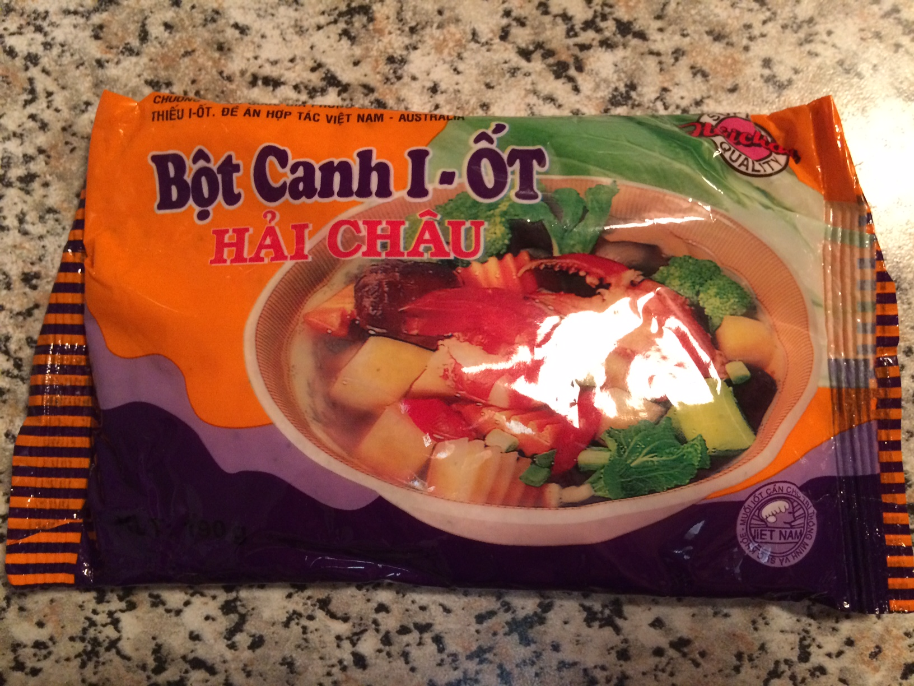

# Сборка Фо Бо

## Системные требования

1. Говядина (шмотки с ног)
2. Фо
3. Лук (который травка)
4. Кинза
5. Пряности. Подойдет любая комбинация из списка:
  * анис звездчатый
  * черный кардамон
  * корица
6. Приправа "За-Ви". Реализация может выглядеть так:

   

   По сути, является смесью соли/глутамата натрия/сахара/перца в приблизительном соотношении 70%/15%/10%/5%.

Release готовится часа за два, но большая часть времени - ожидание компиляции мяса.

## Компиляция

При достаточной сноровке все 3 пункта можно исполнить параллельно. Но в первый раз лучше неспешно осознать весь дзен процесса и аккуратно выполнить в строгой последовательности.

### Пряности

Подобрать нужное количество пряностей с первого раза будет сложно. Стоит начать с одного цветка аниса.

1. Помыть в холодной воде
2. Пожарить до легкой желтизны, без масла
3. И чтоб высохло!
3. Выключить плиту, оставить

### Мясо

"Бо" - значит говядина =)

1. Положить в контейнер (кастрюля подойдет)
2. Залить холодной водой. Воды должно быть достаточно для последующего использования в качестве бульона. Помни, при кипячении вода - испаряется!
3. Довести до кипячения
4. Снять пену
5. Уменьшить огонь до степени, достаточного для поддержания легкого кипячения
6. Закинуть приправ
7. Насыпать За-Ви по вкусу
7. Варить до часа, иначе мясо развалится
8. Мясо вытащить, бульон сохранить
10. Заставить мясо остыть как следует. Можно даже в холодильник закинуть, тогда при порезке мясо не будет крошиться.
11. Порезать тончайшими ломтиками

### Фо

1. Налить в кастрюлю (новую, не в мясной бульон!) побольше воды
2. Вскипятить
2. Закинуть Фо
3. Варить до нужной степени мягкости. До нужной консистенции доходит довольно быстро, поэтому не отходите далеко от плиты и следите.
4. Свалить в дуршлаг
5. Хорошенько промыть холодной водой

## Линковка

1. Вскипятить мясной бульон
1. Положить Фо в большую миску
2. Наложить сверху мяса
3. Следующим слоем положить нарезанный лук и кинзу
4. Залить бульоном
